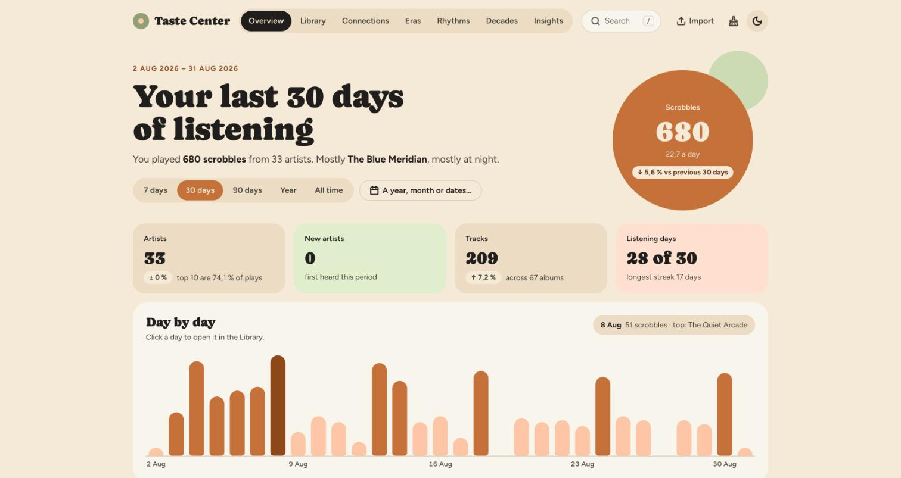
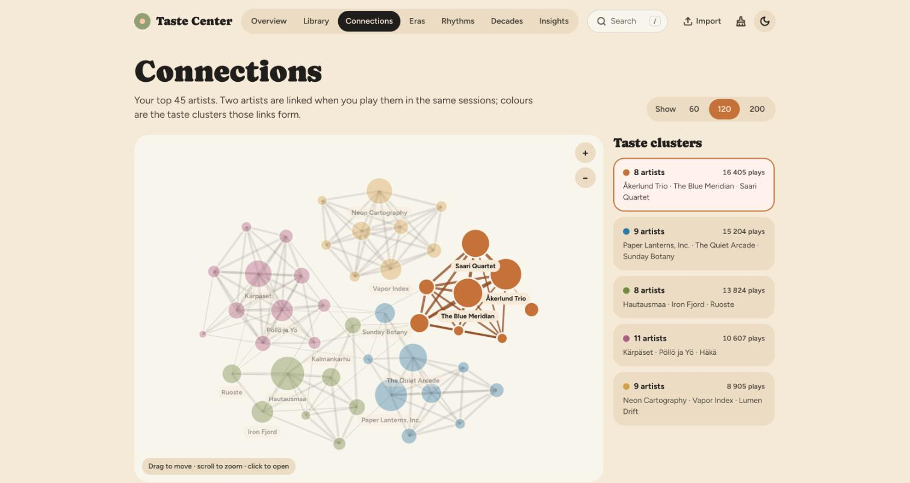
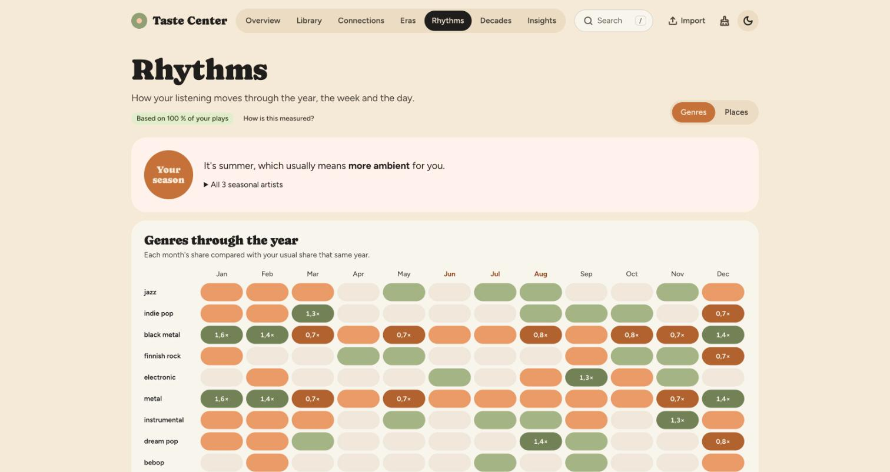
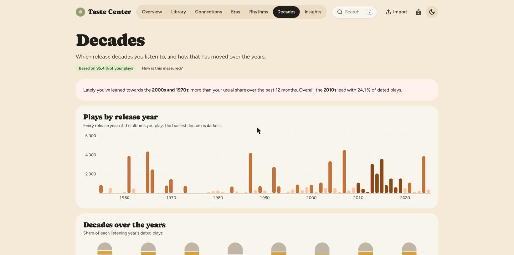

# Taste Center

**Your last.fm listening history, on your own computer.** Every play you've logged on last.fm (a "scrobble") becomes something you can browse, search and explore: how your taste connects, how it changes through the year, and where your music comes from. No ads, no extra account, nothing uploaded. Everything lives in one file on your machine.



<sub>All screenshots show a fictional listening history.</sub>

Ready to try it? Jump to [Install and start](#install-and-start).

## What you can do with it

- **See your listening at a glance** for any period: totals, top artists, tracks and albums, new discoveries.
- **See how your taste connects.** Artists you play in the same sessions are linked into taste clusters.
- **Spot your rhythms.** Which genres belong to which season, time of day or weekday.
- **Look at the decades.** Where your music comes from, and how long you took to find it.
- **Rediscover things.** Forgotten favourites, artists on the rise, recommendations from your own past.
- **Keep your library tidy.** Merge artists that last.fm spells in more than one way.


*Connections: your top artists, linked when you play them together.*


*Rhythms: which genres you play in which season.*


*Decades: when the music you play was released.*

## What you need

- **Python 3.13 or newer.** It's free and runs the app behind the scenes. To check whether you have it, open a terminal (see below) and type `python3 --version` (on Windows: `py --version`). If it's missing or older, install it from [python.org](https://www.python.org/downloads/): download the installer and click through it. On Windows, tick **Add python.exe to PATH** in the installer's first window.
- **A last.fm account with some listening history,** and a free **API key** (explained below, in step 1 of "Get your listening history in"). You can try the app without either: see [the fictional demo library](docs/developer-guide.md#a-fictional-demo-library) (this one needs a terminal).
- **An internet connection** to install, to download your history and to fetch genres and release dates. After that you can browse offline, except that album covers load from last.fm.
- **Little disk space.** A library with a couple of hundred thousand scrobbles, with all its genres and release dates, takes under 100 MB.

The app runs on your own computer and opens in your web browser. It isn't a website, and other computers can't reach it.

## Install and start

1. **Download the code.** On this page, click the green **Code** button, then **Download ZIP**. Double-click the downloaded file to unpack it (on Windows: right-click it, **Extract All**). You get a folder named something like `music-taste-center-main`. Put it somewhere permanent, for example in Documents: **your listening history will be stored inside this folder.**
2. **Start the app.**
   - **On a Mac:** open the folder and double-click **`Taste Center.command`**. The first time, it sets everything up (about a minute, with internet) and then opens the app in your browser. If macOS says it can't open the file because it was downloaded, try once more, then open **System Settings → Privacy & Security**, scroll down and click **Open Anyway** next to `Taste Center.command` (on older macOS versions: right-click the file, choose **Open**, then **Open** again). A black Terminal window stays open while the app runs: **closing that window stops the app.** You can drag the file to the Dock for one-click access.
   - **On Linux, or on a Mac if you prefer typing:** open a terminal in the folder (a terminal is a window where you type commands; on a Mac open the **Terminal** app, type `cd ` with a space after it, drag the folder into the window and press Enter) and run these three lines. The first two only the first time (they set up a private folder with the app's helper software):

     ```sh
     python3 -m venv .venv
     .venv/bin/pip install -r requirements.txt
     .venv/bin/python app.py
     ```

     Then open <http://127.0.0.1:8765> in your browser (that address points at your own computer). Press **Ctrl+C** in the terminal to stop the app.
   - **On Windows:** this should work but hasn't been tested there. Open the folder in File Explorer, click the address bar, type `cmd` and press Enter. Then run, one at a time, `py -m venv .venv` and `.venv\Scripts\pip install -r requirements.txt` (only the first time), and then `.venv\Scripts\python app.py`. Open <http://127.0.0.1:8765> in your browser, and press **Ctrl+C** in the window to stop.

The app starts empty. Next, bring in your history.

## Get your listening history in

Choose whichever suits you. You can use both: the app skips scrobbles it already has.

### Option A: connect your last.fm account (easiest)

1. **Get your free API key.** An API key works like a password that lets this app read your history from last.fm. Open [the last.fm API sign-up page](https://www.last.fm/api/account/create) (sign in if asked), fill in the short form (an application name such as "Taste Center" and a description is enough), and submit. The page then shows your **API key**, a long string of letters and numbers. Keep it open to copy from.
2. **Save your details in the app.** Open the **Import** page. In the **last.fm account** card, type your last.fm **username** and press **Save**, then paste your **API key** and press **Save**. A green "works" badge appears next to the key.
3. **Restart the app.** On a Mac: close the Terminal window, then double-click `Taste Center.command` again. On Windows or Linux: press Ctrl+C in the terminal, then run the last command again (the one ending in `app.py`; the Up arrow key brings it back). Then reload the page in your browser.

The app now downloads your history in the background. **It shows no progress and nothing appears until the whole download is finished**; for a large library that takes a few minutes. Reload the page after a while. Libraries of up to about 400,000 scrobbles download this way; for a bigger one, use Option B.

From then on, every time you start the app it fetches the scrobbles you've added since. It also refreshes your loved tracks, shown with a heart. It does this at most three times a day, at least four hours apart. If you restart the app sooner than that, it just skips the update. To force one, run `.venv/bin/python -m mtc update --force` in a terminal opened in the app's folder (see [Install and start](#install-and-start); on Windows, `.venv\Scripts\python -m mtc update --force`).

### Option B: import a file you already have

If you have your scrobbles in a CSV file, for example from one of the free "export last.fm scrobbles" tools, drag the file onto the **Import** page. Importing a newer, bigger file later is safe: scrobbles you already have (same time, artist and track) are skipped.

The file needs the artist, track and date of each play, and the album if possible. Any comma-separated file with columns named `artist`, `album`, `track` and `date` works, with or without a header row; without one, the columns are read in the order artist, album, track, date. Dates without a time zone are read as UTC, which is what last.fm uses. Rows the app can't read are skipped and counted on the Import page.

## Add genres, covers and release dates

Your scrobbles only say *what* you played and *when*. To unlock **genres**, **Rhythms**, **Decades** and album covers, the app looks your artists and albums up:

1. Save your API key on the **Import** page if you haven't yet.
2. In the **Tags, covers & release dates** card, press **Fetch tags & covers**.

It works through your most-played artists and albums first, in the background, with progress on the page. You can browse while it runs. For a big library it can take hours, because the app is polite to last.fm and MusicBrainz (the free music database that supplies release dates) and sends only a couple of requests per second. Press **Stop** at any time, or close the app: everything fetched so far is kept, and the next fetch carries on where it stopped.

## The pages

<details>
<summary>What each page shows</summary>

| Page | What it shows |
|---|---|
| **Overview** | Totals and the change from the previous period, scrobbles per day or month, top artists, tracks and albums, new discoveries, and a listening clock |
| **Library** | Every artist, sortable and filterable, plus top lists and genres for any period |
| **Artist** | Plays per month, a velocity chart of how fast you played the artist (compare it with other artists), top tracks and albums, how you discovered the artist and where it led you, who you play it alongside, and time of day |
| **Connections** | Your top artists as a graph, linked by listening together, with taste clusters |
| **Eras** | Each year in review: top artists, the artist that defined it, and the biggest discovery |
| **Rhythms** | Genres (or places) through the year, the week and the day, seasonal artists, and how varied your taste is |
| **Decades** | Release decades, the age of the music you play, how long you took to find albums, and older records |
| **Insights** | Rediscover, on the rise, forgotten favourites, obsessions, staying power, gateways, binges, loved tracks you've left behind and more |
| **Upcoming** | New albums and EPs for this Friday and the six after it: by new artists similar to the ones you play (with your last.fm API key) and by your own artists, and a ready-made prompt about your taste to paste into any AI assistant (new releases, new artists, or just your taste) |
| **Cleanup** (broom icon) | Merge duplicate spellings of an artist; the fix sticks for future imports |
| **Import** (upload icon) | Add scrobbles, connect your account, and fetch genres, covers and release dates |

</details>

Press **/** anywhere to search. The moon button in the top right switches between light and dark. For what each page measures and how, see [How it works](docs/how-it-works.md).

## Your data and privacy

- **Everything stays on your computer.** Your history lives in `data/mtc.db`, and your username and API key in `data/settings.json`, both inside the app's folder and both kept out of git. The app listens only on your own machine.
- **What is sent out.** Only when you download or fetch: your last.fm username and API key to last.fm; artist and album names to last.fm and MusicBrainz; and your browser loads album covers from last.fm's servers. The Upcoming page asks ListenBrainz and Wikipedia for their lists of new releases (only dates are sent, nothing about you), asks last.fm for artists similar to the ones you play most and for the genre tags of artists with new releases, and loads release covers from the Cover Art Archive. The fonts are bundled, so nothing else is loaded from the internet.
- **Back up** by closing the app and copying the whole `data` folder.
- **Update** by closing the app, downloading the new ZIP, unpacking it and copying your old `data` folder into the new folder. Don't copy the hidden `.venv` folder; the new version sets itself up again the first time you start it. Delete the old folder only after you've checked that your history shows up.
- **Move or rename the app's folder?** Delete the hidden `.venv` folder inside it first; it is rebuilt on the next start.
- **Start over** by closing the app and deleting the file `mtc.db` in the `data` folder (and `mtc.db-wal` and `mtc.db-shm` if they are there). **This erases your imported history for good**, so back it up first if you're unsure. Your saved username and API key stay in `settings.json`; delete that file too if you want those gone.

Taste Center is an independent hobby project. It isn't made by or affiliated with Last.fm, MusicBrainz, ListenBrainz or Wikipedia; it uses their public APIs.

## Troubleshooting

- **"No scrobbles yet" after connecting your account.** The download starts when the app starts, at most three times a day and four hours apart. Check that your username and API key are saved on the Import page (the key shows a green "works" badge), restart the app, and wait a few minutes. If it still shows nothing, open a terminal in the app's folder (see [Install and start](#install-and-start)) and run `.venv/bin/python -m mtc update --status` (on Windows: `.venv\Scripts\python -m mtc update --status`). It prints how the last attempt went, including any error; that is what to quote if you ask for help.
- **The page says it can't connect.** The app isn't running: start it again. If it still fails, another program may be using the same address. Advanced: start the app on a different port with `.venv/bin/python app.py serve --port 8800` and open <http://127.0.0.1:8800> (Mac launcher: `MTC_PORT=8800 "./Taste Center.command"` in Terminal).
- **Times of day look shifted** (you listen at night but the app says afternoon). The app works out days and hours in Finnish time (`Europe/Helsinki`) unless told otherwise, and there is no setting for this inside the app yet. Look up your zone name in [the list of time zones](https://en.wikipedia.org/wiki/List_of_tz_database_time_zones) (examples: `Europe/London`, `America/New_York`, `Asia/Tokyo`) and start the app from a terminal opened in the app's folder with it: `MTC_TZ=America/New_York .venv/bin/python app.py` (on a Mac, `MTC_TZ=America/New_York "./Taste Center.command"`; in Windows PowerShell, first `$env:MTC_TZ = "America/New_York"`). Once, recalculate your history with the same variable set: `MTC_TZ=America/New_York .venv/bin/python -m mtc rebuild`. Use the same zone every time you start the app. A wrong zone name gives a clear error.
- **Decades or Rhythms look empty.** They need genres and release dates: run **Fetch tags & covers** on the Import page and let it work through your library. Each page says what share of your plays it is based on.
- **Some artists appear twice.** Merge them on the **Cleanup** page.

## For developers

How the code is organised, how to run the tests and build a fictional demo library, and the house rules are in the [developer guide](docs/developer-guide.md). The measures behind each page are in [How it works](docs/how-it-works.md).
